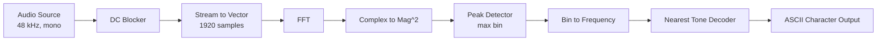
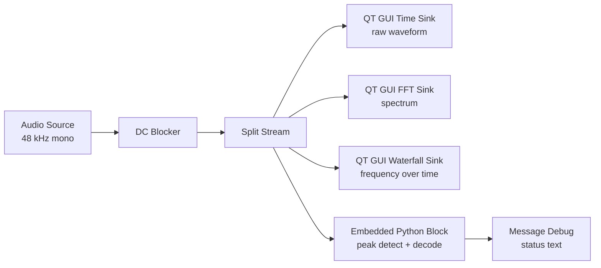

# Acoustic Modem

Browser transmitter for a device-to-device acoustic modem.

## What it does

- Converts  ASCII text into fixed audio tones of frequency 17kHZ+.
- Plays the tones directly through the browser with the Web Audio API
- Documents the GNU Radio receiver layout for live decoding.

## Tone mapping

```text
frequency = 17000 Hz + (ASCII code - 32) × 30 Hz
```

Printable ASCII only: 32 through 126.

That keeps the lowest tone at 17 kHz and the highest tone at 19.82 kHz, which fits inside a 48 kHz sample rate.

## Quick start

1. Open a terminal in this folder.
2. Run the live receiver GUI:

```bash
./run_receiver_gui.sh
```

3. Open the website in a browser and type `HELLO`.
4. Tap Play tones on the phone, or download the WAV and play it through the phone speaker.
5. Hold the phone 10 to 20 cm from the laptop mic.
6. Watch the Qt panel update with the decoded word, time, frequency, FFT bin, and peak power.
7. If the panel stays empty, increase phone volume, reduce room noise, and confirm the mic device in `receiver_gui.py` is the one you actually use.
9. If you see noise-only junk before the phone starts playing, that is the detector being too sensitive; the current code already applies a peak-power gate and only searches the transmit band to ignore weak background noise.

If your laptop microphone is not the default audio source, pass a device name through the wrapper, for example:

```bash
./run_receiver_gui.sh --device default
```

If you still hit a GTK or GLIBC_PRIVATE error, use the wrapper script instead of launching `python3 receiver_gui.py` directly, because it clears the snap-injected library paths before the GUI starts.

For a first check, use a short message like `HELLO` before trying longer text.

## GNU Radio receiver block diagram



## Decoder rule

For each 40 ms window:
   - Select the microphone device
3. Add a DC Blocker block after the source.
4. Add a Stream to Vector block.
   - Vector length: 1920
5. Add an FFT block.
   - Size: 1920
   - Window: Hann or Blackman-Harris
6. Add a Complex to Mag^2 block.
7. Add an Embedded Python Block or custom logic block that does the peak picking.
8. Add a Message Debug block to show the detector's status messages in the console.
9. Add QT GUI Time Sink, FFT Sink, and Waterfall Sink blocks if you want a live signal view.

## Visualize everything

The detector already exists in [embedded_python_block.py](embedded_python_block.py). It now publishes a live `status` message on every symbol, so you can display the decoded word, current character, detected peak frequency, FFT bin, and peak power inside GNU Radio.

Recommended layout:



What each visualization shows:

- QT GUI Time Sink: raw microphone waveform, useful for checking clipping and symbol timing
- QT GUI FFT Sink: current frequency content, useful for seeing the 17 kHz+ tone peak
- QT GUI Waterfall Sink: frequency movement over time, useful for verifying each character slot
- Message Debug: live status strings showing the decoded word, current character, frequency, bin, and peak power in the console output

Connect the Embedded Python Block's `status` message port to Message Debug. That gives you a live decode readout while the QT GUI sinks show the signal itself.

The text can now appear as a widget inside the GNU Radio window by running [receiver_gui.py](receiver_gui.py). It shows the live word, time, character, frequency, FFT bin, peak power, and a scrolling status log.

## Live Qt panel

Run [receiver_gui.py](receiver_gui.py) instead of the plain GRC flowgraph if you want a visible panel inside the GNU Radio window.

The panel shows:

- Word decoded so far
- Symbol time
- Current character
- Detected frequency
- FFT bin
- Peak power
- A scrolling log of every decoded symbol

The Qt window reads the detector's live status text directly from [embedded_python_block.py](embedded_python_block.py), so no extra Message Debug block is required for the on-screen display.

## Qt receiver GUI

Run [receiver_gui.py](receiver_gui.py) to launch a GNU Radio window with a visible status panel.

The panel shows:

- Word so far
- Symbol time
- Current character
- Detected frequency
- FFT bin
- Peak power
- A scrolling log of all decoded symbols

## Embedded Python code

The detector lives in [embedded_python_block.py](embedded_python_block.py). It is a paste-ready GNU Radio Embedded Python Block that:

- Buffers incoming samples until it has one 40 ms symbol window
- Runs an FFT with a Hann window
- Finds the strongest bin
- Converts that bin back to a frequency
- Snaps the frequency to the nearest allowed ASCII tone
- Prints the decoded character to the GNU Radio console

To add it in GNU Radio Companion:

1. Add an Embedded Python Block.
2. Set the input signature to `float` / `float32`.
3. Replace the generated class body with the contents of [embedded_python_block.py](embedded_python_block.py).
4. Make sure the block parameters match the flowgraph:
   - `sample_rate = 48000`
   - `fft_size = 1920`
   - `base_freq = 17000`
   - `step_freq = 30`
7. Connect it after the Audio Source, optionally through a DC Blocker.

If you prefer a pure flowgraph approach, keep the FFT outside the block and change the block to receive one vector per symbol instead of raw floats.

## How to detect it in GNU Radio

The receiver should not try to recover text directly from the waveform. It should only look for the dominant frequency in each chunk.

Use this logic inside the Embedded Python Block:

```python
BASE_FREQ = 17000.0
STEP_FREQ = 30.0
ASCII_MIN = 32
ASCII_MAX = 126

def decode_frequency(freq_hz):
   idx = round((freq_hz - BASE_FREQ) / STEP_FREQ)
   code = ASCII_MIN + idx
   if code < ASCII_MIN or code > ASCII_MAX:
      return None
   nearest = BASE_FREQ + idx * STEP_FREQ
   if abs(freq_hz - nearest) > 30:
      return None
   return chr(code)
```

For the FFT peak, convert the bin index to frequency like this:

```text
freq_hz = peak_bin * sample_rate / fft_size
```

With a 48 kHz sample rate and 1920-point FFT, each bin is 25 Hz wide.

## Practical receiver setup

- Keep the phone 10 to 20 cm from the mic.
- Set the phone volume around medium-high.
- Use a quiet room.
- Start by sending `HELLO` before trying full text.
- Add a short sync prefix if you see window drift.

## GNU Radio Companion block list

1. Audio Source
   - Sample rate: 48000
   - Channels: 1
2. DC Blocker
   - Optional, but useful for mic bias and slow drift
3. Stream to Vector
   - Vector length: 1920
4. FFT
   - Size: 1920
   - Window: Hann or Blackman-Harris
5. Complex to Mag^2
6. Peak detector or max-bin logic in an Embedded Python Block
7. Embedded Python Block
   - Convert the peak bin to frequency
   - Snap to the nearest valid character tone
   - Reject peaks too far from the expected frequencies
8. QT GUI Text Edit or Message Debug
   - Append decoded characters to the output stream

## Recommended first test

Start with `HELLO`, then a tiny alphabet such as `ABCDE`, before expanding to the full printable ASCII range.
